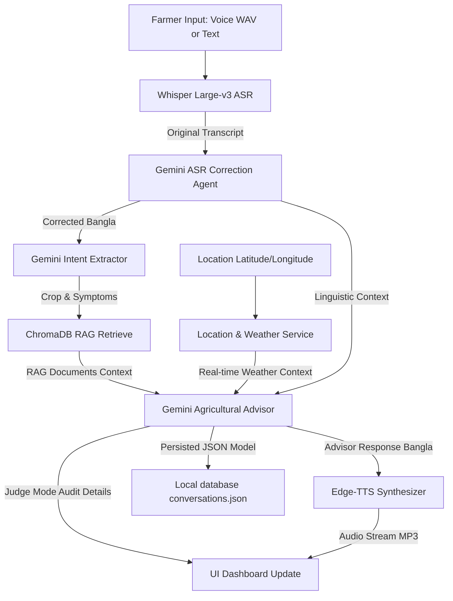

# KrishiKantho AI (কৃষিকণ্ঠ এআই) 🌾
> **A Production-Quality Voice-First Agricultural Advisory Platform for Bangladeshi Farmers**

KrishiKantho AI is a localized, intelligent agricultural assistant. It allows farmers to speak naturally in Bangla, Banglish, or regional dialects (such as Mymensingh or Sylhet) to report crop issues. The system cleans and corrects speech ASR errors, queries a localized RAG database containing BRRI/BARI guidelines, retrieves real-time weather and climate details, and synthesizes localized recommendations into spoken Bengali and text.

---

## 🌟 Core Features

- **Voice-First Interaction**: Integrated HTML5 MediaRecorder voice capture with custom audio processing (noise filtering, peak normalization, silent trimming).
- **Linguistic Error Correction**: Uses Gemini to repair errors from Automatic Speech Recognition (ASR) and translates regional dialects to standard Bengali.
- **Micro-Climate Context Integration**: Fetches real-time weather stats (temperature, humidity, wind, rainfall) and 3-day agricultural forecasts via OpenWeatherMap coordinates.
- **Local Knowledge RAG**: Ingests agricultural manuals (PDF/TXT) into ChromaDB using Sentence-Transformer embeddings, retrieving matched guides for Rice, Wheat, Tomato, Jute, Poultry, and Fisheries.
- **Neural Text-to-Speech (TTS)**: Zero-config Bengali speech synthesis using high-fidelity Microsoft Edge neural voices (`bn-BD-NabanitaNeural` / `bn-BD-PradeepNeural`).
- **"Why This Recommendation?" (Judge Mode)**: Audit card exposing weather factors analyzed, retrieved RAG document sources, AI confidence score, and internal reasoning steps.
- **Conversation Logs (History)**: Persists session files to a local database with full load, view, and delete functionalities.
- **Premium Glassmorphic UI**: Double-themed responsive dashboard with pulsating micro-animations, audio scrubbers, and fallback text queries.

---

## 🏗️ Clean MVC Architecture
The system strictly enforces a Model-View-Controller separation to keep controllers clear of business logic:

```
g:\projects\farmer\
├── app\
│   ├── config\
│   │   └── settings.py          # Environment settings and paths
│   ├── models\
│   │   ├── farmer.py            # Farmer model/schema
│   │   ├── diagnosis.py         # Diagnosis model/schema
│   │   ├── weather.py           # Weather model/schema
│   │   └── conversation.py      # Conversation schema
│   ├── repositories\
│   │   ├── vector_store.py      # ChromaDB integration
│   │   └── conversation_store.py# JSON/SQLite storage integration
│   ├── services\
│   │   ├── whisper_service.py   # Speech-to-Text (ASR) service
│   │   ├── gemini_service.py    # LLM agents (ASR correction, Intent, Advisor)
│   │   ├── rag_service.py       # Similarity search & doc loader
│   │   ├── weather_service.py   # OpenWeatherMap & simulation fallbacks
│   │   ├── location_service.py  # Coordinates to district resolver
│   │   └── tts_service.py       # Speech synthesis service
│   ├── controllers\
│   │   ├── audio_controller.py  # Handles audio upload & validation
│   │   ├── weather_controller.py# Exposes current & forecast conditions
│   │   ├── tts_controller.py    # Exposes voice synthesizer
│   │   └── diagnosis_controller.py # Core agricultural pipeline execution
│   └── views\
│       ├── templates\
│       │   └── index.html       # Landing and UI dashboard page
│       └── static\
│           ├── css\
│           │   └── styles.css   # Premium glassmorphic styles
│           └── js\
│               └── app.js       # Audio recorders, API fetches, players
├── data\                        # Persistent databases, logs, uploads, audio
│   ├── documents\               # Source manuals for RAG ingestion
│   ├── chromadb\                # Chroma Vector Database files
│   ├── uploads\                 # Uploaded recorded farmer WAVs
│   ├── tts\                     # Generated advisor MP3s
│   └── conversations.json       # Persisted history logs
├── .env                         # API keys configuration
├── requirements.txt             # Python dependencies
├── ingest_knowledge.py          # CLI tool to ingest guides to ChromaDB
└── app.py                       # Root launcher entrypoint
```

---

## 🛠️ Installation & Setup

### 1. Prerequisites
- **Python**: Python 3.10+ is recommended.
- **FFmpeg**: Required for audio conversion. Must be installed and on your system path.
  - *Windows*: Download from [ffmpeg.org](https://ffmpeg.org/), extract, and add the `/bin` directory to the system `Path` environment variables.

### 2. Install Dependencies
Run the following command from the project root:
```bash
pip install -r requirements.txt
```

### 3. Environment Variables
Create a `.env` file in the root directory based on `.env.example`:
```env
GEMINI_API_KEY=your_gemini_api_key_here
OPENWEATHER_API_KEY=your_openweather_api_key_here
PORT=5000
```
*Note: If no API keys are provided, the application runs on a robust simulated offline/mock mode to allow visual testing and evaluation without credentials.*

---

## 🚀 Running the Application

### 1. Ingest Knowledge Base Documents
Before starting the app, run the ingestion tool to seed ChromaDB with agricultural manuals:
```bash
# Ingest all guides placed inside data/documents/ (e.g. rice_blast_guide.txt)
python ingest_knowledge.py

# Ingest a specific manual with a crop category tag
python ingest_knowledge.py --file path/to/manual.pdf --crop rice

# Reset the database and re-ingest
python ingest_knowledge.py --reset
```
*Note: On first initialization, if the vector store is empty, `RAGService` automatically imports default pre-packaged seed guides for Rice, Wheat, Tomato, Jute, Poultry, and Fisheries.*

### 2. Start the Flask Server
Run the launcher:
```bash
python app.py
```
Open your browser and navigate to `http://127.0.0.1:5000`.

---

## 🔍 The AI Diagnostic Pipeline
When a farmer triggers `/api/diagnose`, the system processes the input sequentially through these modules:



---

## 📊 API Reference

### 1. `POST /api/diagnose`
Core pipeline execution endpoint.
- **Request Payload**:
  ```json
  {
    "audio_path": "data/uploads/recorded_voice.wav", // optional
    "text_query": "ধানের পাতায় বাদামী দাগ পড়েছে",     // optional (if no audio)
    "lat": 24.7471,                                  // optional
    "lon": 90.4203,                                  // optional
    "district": "mymensingh"                         // optional
  }
  ```
- **Response Structure**:
  ```json
  {
    "conversation_id": "b3275b5b-7027-4bba-84ca-5946926a61ee",
    "original_transcript": "আমার ধানের পাতায় বাদামী দাগ পড়েছে",
    "corrected_bangla": "আমার ধানের পাতায় বাদামী দাগ পড়েছে",
    "english_translation": "Brown spots have appeared on my rice leaves.",
    "crop": "rice",
    "symptoms": "brown spots on leaves",
    "severity": "Medium",
    "urgency": "Medium",
    "weather": {
      "temp": 29.5,
      "humidity": 80,
      "rainfall": 1.2,
      "resolved_district": "Mymensingh"
    },
    "recommendation_text": "কৃষক ভাই, এটি ধানের ব্লাস্ট রোগ হতে পারে... ট্রাইসাইক্লাজল ৭২ ডব্লিউপি স্প্রে করুন...",
    "recommendation_audio_url": "/static/audio/tts_2512371921.mp3",
    "rag_sources": [
      {
        "source": "rice_blast_guide.txt",
        "text_chunk": "Bangladesh Rice Research Institute (BRRI) Rice Blast Guidelines..."
      }
    ],
    "judge_mode": {
      "weather_factors_used": "High humidity (80%) creates a ripe environment for fungal blast spores.",
      "retrieved_documents_used": ["rice_blast_guide.txt"],
      "ai_confidence_score": 0.85,
      "reasoning_summary": "Symptoms match Rice Leaf Blast guidelines exactly."
    },
    "timestamp": "2026-06-25T13:44:00"
  }
  ```

### 2. `POST /api/audio/upload`
Uploads voice recordings from the browser.
- **Request**: Multipart Form Data with key `audio`.
- **Response**: `{"file_path": "data/uploads/recorded_farmer_voice.wav"}`

### 3. `GET /api/weather`
Resolves latitude/longitude to a district and fetches weather stats.
- **Query Params**: `lat`, `lon` or `district`.

### 4. `GET /api/history`
Exposes the last 10-50 saved diagnosis interactions.

### 5. `DELETE /api/history/delete/<conversation_id>`
Deletes a specific history record from log files.
